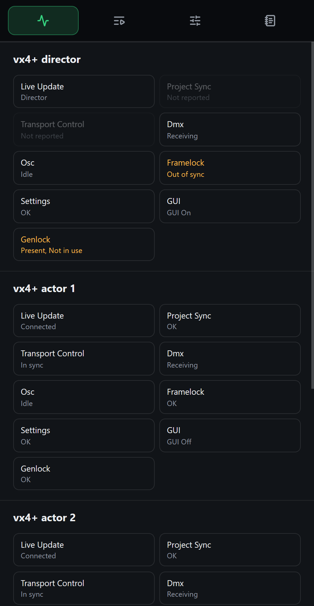
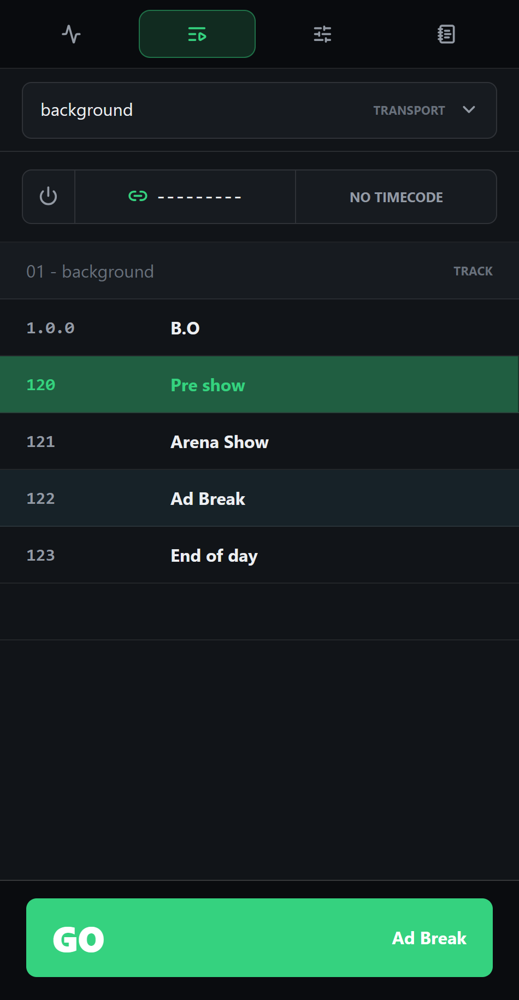
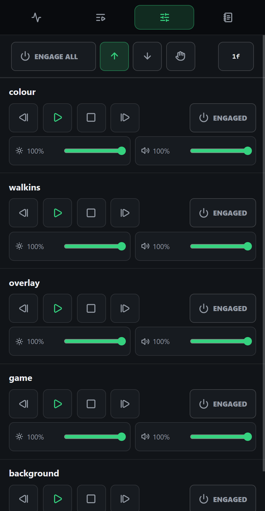
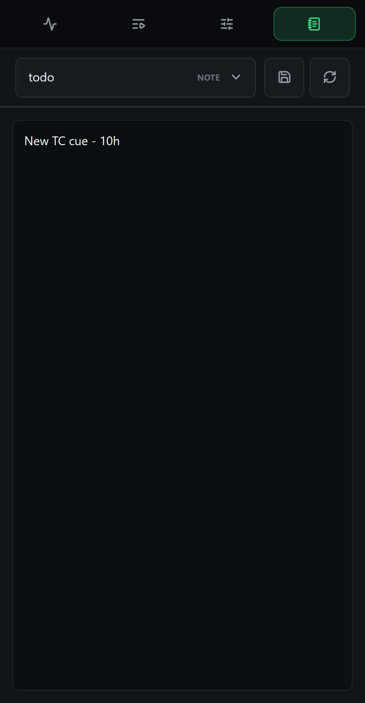
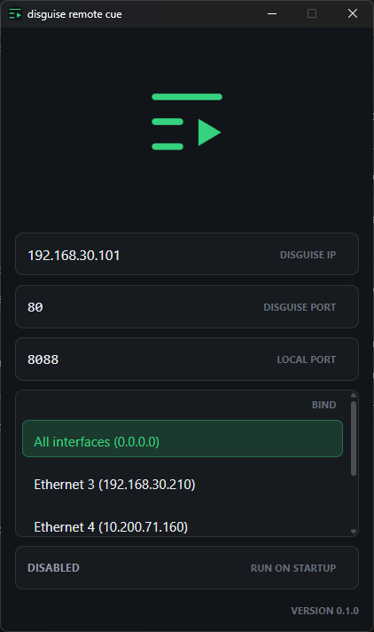

# disguise remote cue

A small tray app and mobile-friendly web UI for controlling disguise cues.

## Screenshots

<table>
  <tr>
    <td></td>
    <td></td>
    <td></td>
  </tr>
  <tr>
    <td></td>
    <td></td>
    <td></td>
  </tr>
</table>

## Development

```sh
npm install
npm --prefix frontend install
npm start
```

## Build

```sh
npm run dist
```
